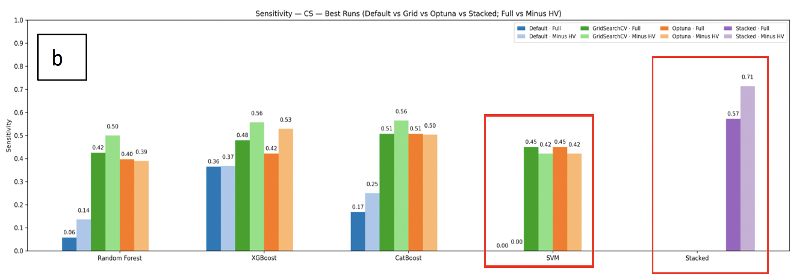
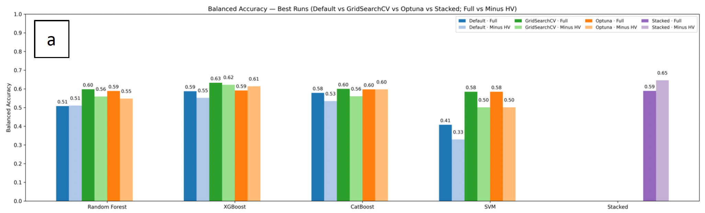
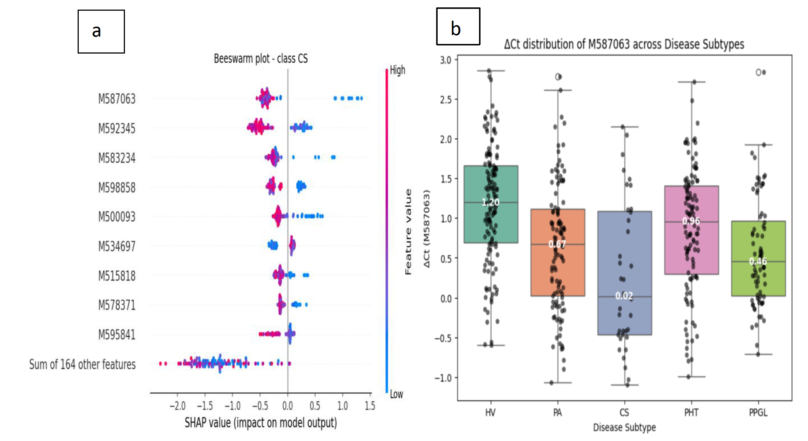

# Fairness-Aware Machine Learning for Hypertension Subtype Classification from Circulating microRNA

> This project follows reproducible ML practices, including fixed seeds, stratified cross-validation, and fairness-aware evaluation for imbalanced biomedical data.

ML pipeline for imbalanced multi-class classification of endocrine hypertension using circulating microRNA, **improving rare subtype detection (0.00 → 0.71 sensitivity)** through fairness-aware evaluation, hyperparameter optimization, and ensemble learning.


---

## Problem

Endocrine hypertension subtypes (e.g., Cushing’s syndrome, primary aldosteronism, PPGL) are frequently misdiagnosed as primary hypertension, leading to delayed or inappropriate treatment.

Circulating microRNAs offer a promising **non-invasive biomarker**, but classification is challenging due to:

- Severe class imbalance  
- Small sample sizes for rare subtypes  
- High-dimensional biological data  

---

## Why This Is Challenging

- Minority classes (e.g., Cushing’s syndrome) are underrepresented  
- **Standard accuracy is misleading in imbalanced datasets**
- Models tend to favor majority classes and ignore rare but clinically critical subtypes  
- There is a trade-off between overall performance and minority-class detection  

---

## Key Idea

Instead of optimizing for overall accuracy, this project prioritizes **fairness-aware evaluation**:

- **Balanced accuracy** → equal importance across all classes  
- **Minimum sensitivity** → protects the worst-performing class  

This ensures that rare but clinically important subtypes are not overlooked.

---

## Approach

All model training, tuning, and stacking pipelines are implemented as modular Python scripts in the `src/` directory, with corresponding SLURM job files for HPC execution in the `slurm/` directory.

### Models
- Random Forest  
- XGBoost  
- CatBoost  
- Support Vector Machine (SVM)  

### Optimization
- GridSearchCV (exhaustive search)  
- Optuna (Bayesian optimization)  

### Imbalance Handling
- Class weighting / sample weighting  
- Stratified cross-validation  

### Ensemble
- Stacking with Logistic Regression meta-learner  

### Interpretability
- SHAP for feature importance  

---

## Key Results

- Improved sensitivity for smallest class (Cushing’s syndrome):  
  - **0.00 → 0.71**  
- Minimum sensitivity improved across all models  
- Final stacked model:  
  - **Balanced accuracy: ~0.65**  
- Identified biologically relevant microRNA driving CS classification (via SHAP)  

---

## Model Performance




## Model Interpretation (SHAP)



---

## Technical Highlights

- Imbalanced multi-class classification  
- Fairness-aware model evaluation  
- Hyperparameter optimization at scale (HPC)  
- Ensemble learning (stacking)  
- Model interpretability (SHAP)  
- Reproducible ML pipelines with SLURM  

---

## Tech Stack

- Python (scikit-learn, XGBoost, CatBoost)  
- Optuna  
- SHAP  
- NumPy, pandas  
- Matplotlib, seaborn  
- SLURM (HPC)  

## How to Run

Clone the repository:

```bash
git clone <your-repo-url>
cd <repo-name>
```

Install dependencies:

```bash
pip install -r requirements.txt
```

Run a model (example):

```bash
python src/models/random_forest_gridsearch.py
```

